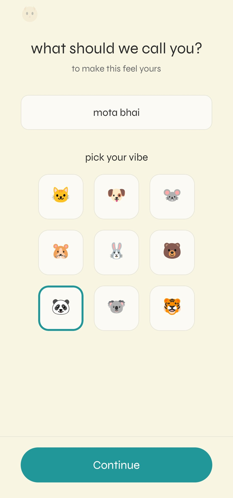
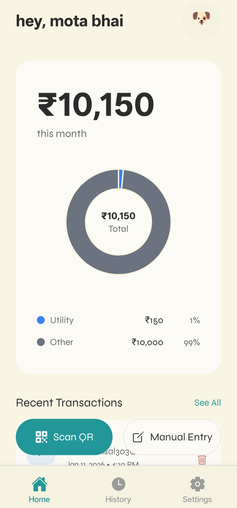
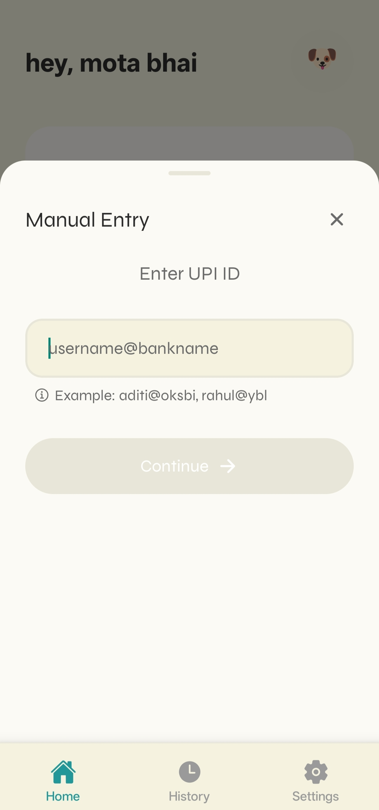
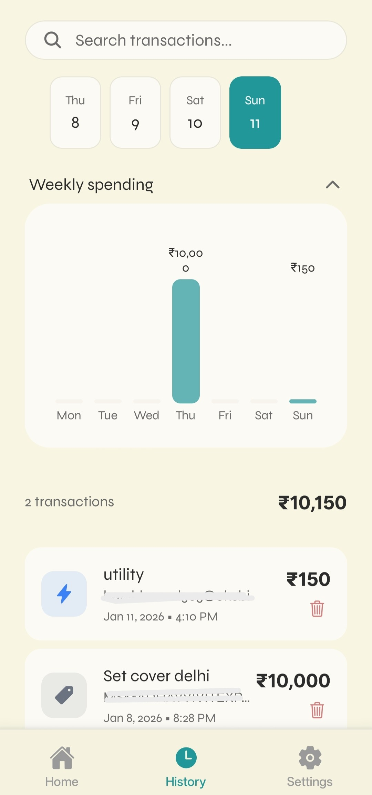
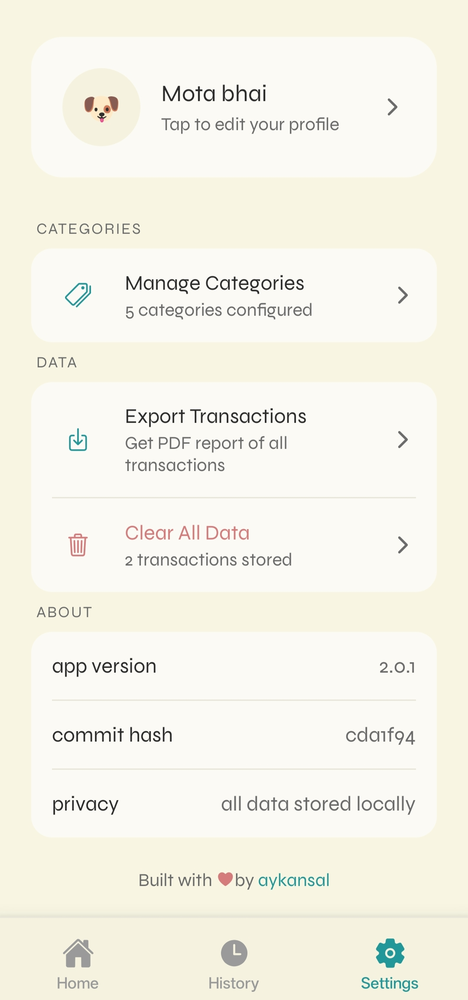
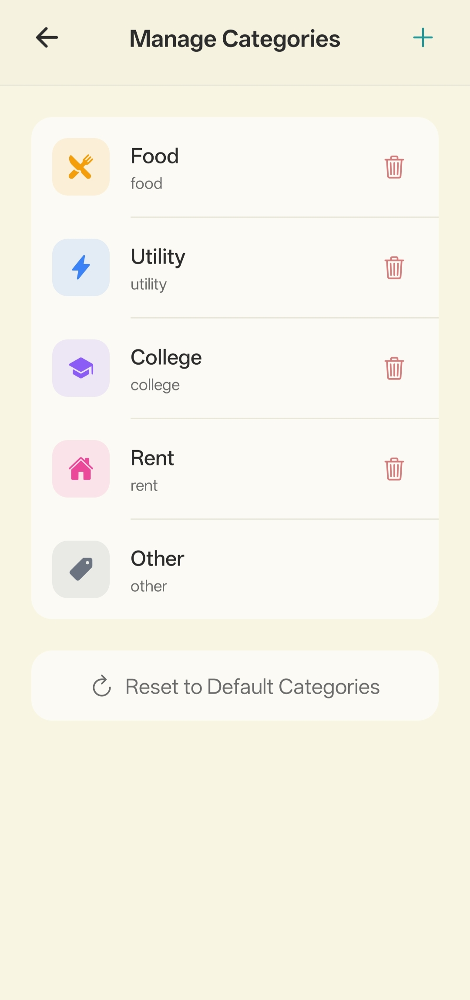

# UPI Tracker 

It's a privacy-first Android app I built to track my UPI expenses using the UPI URI scheme and UPI deeplinks instead of bank integrations or SMS scraping.

## Context and Problem

I do >90% of my transactions via UPI. Existing expense trackers want:
- KYC and bank account linking  
- SMS read permissions and cloud sync  

I wanted a **local-only**, UPI-first tracker that works entirely on top of:
- UPI QR codes  
- UPI URI scheme (`upi://pay`)  
- UPI Intent/deeplink flow to apps like Google Pay and PhonePe

No KYC, no bank APIs, no servers.

## Demo

  

<!-- 

  
  
  

 -->

<!-- 

  
  
  
  

 -->

## What the App Does (Technically)

Core flow:
- Scan UPI QR codes via camera → parse the **UPI URI** (e.g. `upi://pay?pa=...&pn=...&am=...&tn=...&cu=INR`).
- Extract payee UPI ID, payee name, amount, and note using a dedicated **UPI parser service**.
- Let me add structured metadata:
  - Category (fixed enum: Food, Utility, College, Rent, Other)  
  - Reason  
  - Optional description
- Launch the user’s UPI app using Android **UPI Intent / deeplink integration** with prefilled fields.
- Store transaction data locally in **AsyncStorage** with:
  - UUID, amount, UPI ID, payee, category, reason, timestamp, `monthKey` for grouping.
- Provide:
  - Monthly aggregation and category breakdown  
  - Search across payee, UPI ID, category, reason  
  - PDF export with charts using `expo-print`, `react-native-svg`, and `react-native-chart-kit`.

Everything is local storage + UPI URI scheme + Android Intent flow. No backend, no external APIs.

## Architecture Snapshot

The app is intentionally small but structured:

- **Frameworks**: React Native + Expo + TypeScript, Expo Router for navigation.
- **Architecture patterns**:
  - Service layer pattern for business logic (storage, UPI, categories, PDF).
  - Repository-style access to AsyncStorage keys (`upitracker:transactions`, `upitracker:categories`).
  - Component composition for UI (cards, pickers, charts).

**Key services:**
- `storage` service: CRUD, monthly stats, search, delete, clear-all.
- `upi-parser` service: UPI URI parsing, validation, URL decoding/encoding.
- `upi-launcher` service: build UPI deeplink, check **UPI-capable apps**, fire Android Intent.
- `category-storage` service: enum-like category model with icon + color metadata.
- `pdf-export` service: HTML + SVG pie chart → PDF via `expo-print` → share via `expo-sharing`.

**UI layer** (Expo Router):
- `Home`: monthly stats, category pie chart, recent transactions.
- `Scanner`: full-screen camera with QR detection for UPI QR codes.
- `Payment`: confirm parsed UPI data + metadata, triggers UPI Intent.
- `History`: list + search + per-transaction delete.
- `Settings`: export PDF, clear-all, theme controls.

Dark-mode default with a defined theme system (tokens for colors, spacing, typography).

## Process and Tooling

This app was not built from a single “generate app” prompt.

The workflow was:
- Write **architecture and data-model docs first**, including UPI Intent flow, AsyncStorage schema, and service boundaries.
- Use Cursor IDE + Perplexity AI in **multi-turn iterations**:
  - Explore UPI URI scheme edge cases and Intent behavior.  
  - Refine service layer and transaction models.  
  - Validate privacy-first choices (no analytics, no network).
- Then implement the app screen by screen, wired to the services already defined in docs.

UPI Tracker is essentially a concrete implementation of:
- UPI URI scheme + deeplink flow  
- Local-only data architecture on AsyncStorage  
- Service-layer React Native app for a single, very specific UPI expense-tracking use case

## Developer
coded with ❤️ by [Ayush Kansal](https://linkedin.com/in/aykansal)