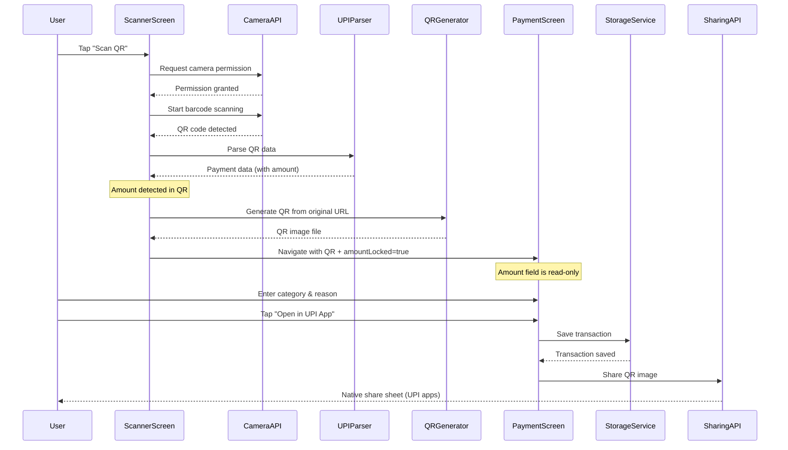
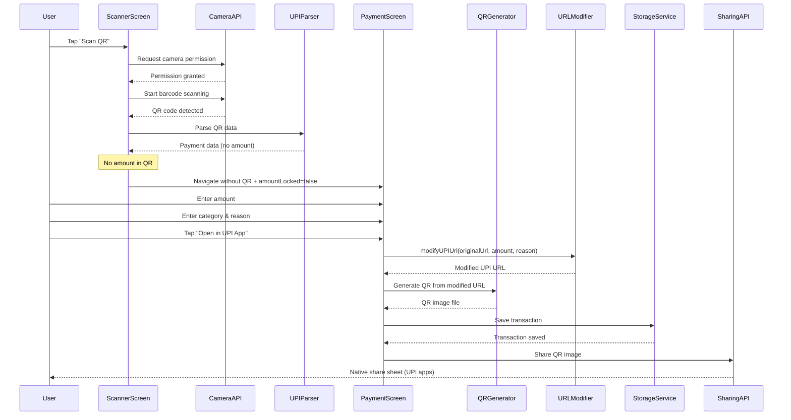
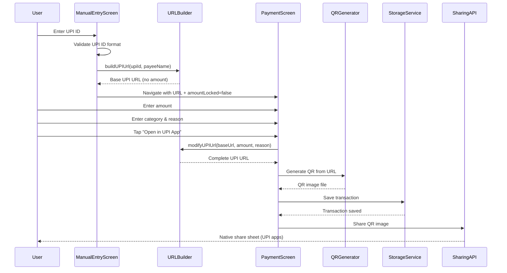
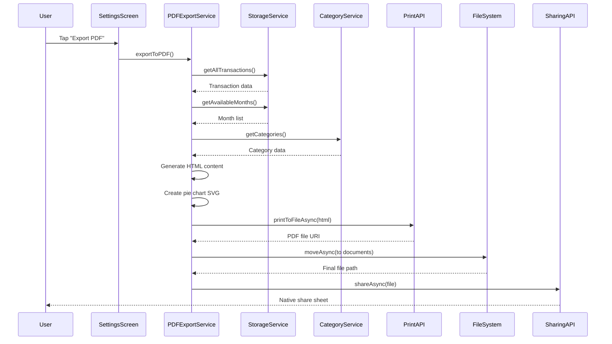

# UPI Tracker - Technical Architecture Documentation

## 📋 Table of Contents

1. [Project Overview](#project-overview)
2. [Technology Stack](#technology-stack)
3. [Application Architecture](#application-architecture)
4. [Data Models & Types](#data-models--types)
5. [Core Services & Business Logic](#core-services--business-logic)
6. [UI Architecture & Components](#ui-architecture--components)
7. [Navigation Architecture](#navigation-architecture)
8. [Storage Architecture](#storage-architecture)
9. [Security & Privacy](#security--privacy)
10. [Sequence Diagrams](#sequence-diagrams)
11. [Key Features Implementation](#key-features-implementation)
12. [Deployment & Build](#deployment--build)

## 🎯 Project Overview

UPI Tracker is a privacy-first mobile application designed to track UPI payments in India without requiring bank accounts or KYC registration. The app provides secure, local-only storage of transaction data with advanced analytics and reporting capabilities.

### Key Features
- **QR Code Scanning**: Automatic UPI QR code recognition and data extraction
- **Privacy-First**: All data stored locally on device, no cloud storage
- **Smart Categorization**: Dynamic expense categorization with custom categories
- **Analytics Dashboard**: Interactive charts and spending insights
- **PDF Reports**: Professional expense reports with visual breakdowns
- **Manual Entry**: Support for transactions not captured via QR scanning
- **Search & Filter**: Advanced transaction search across all data
- **Dark/Light Themes**: Modern UI with theme customization

### Target Users
- Indian consumers using UPI for digital payments
- Small business owners tracking expenses
- Privacy-conscious individuals avoiding bank-linked expense trackers
- Users concerned about data security and financial privacy

## 🛠️ Technology Stack

### Core Framework
- **React Native 0.81.5** - Cross-platform mobile development
- **Expo SDK 54** - Development platform and native APIs
- **Expo Router 6** - File-based navigation and routing

### Programming Languages
- **TypeScript 5.9** - Type-safe JavaScript development
- **JavaScript (ES2020+)** - Modern JavaScript features

### Key Dependencies

#### Navigation & Routing
```json
"@react-navigation/native": "^7.1.8",
"@react-navigation/bottom-tabs": "^7.4.0",
"expo-router": "~6.0.21"
```

#### Storage & Data Persistence
```json
"@react-native-async-storage/async-storage": "^2.2.0",
"expo-crypto": "~15.0.8",
"expo-file-system": "^19.0.21"
```

#### UI & Styling
```json
"react-native-reanimated": "~4.1.1",
"react-native-safe-area-context": "~5.6.0",
"react-native-svg": "15.12.1",
"@expo/vector-icons": "^15.0.3"
```

#### UPI Integration & QR Generation
```json
"expo-camera": "^17.0.10",
"expo-linking": "~8.0.11",
"expo-intent-launcher": "^13.0.8",
"expo-sharing": "^14.0.8",
"react-native-qrcode-svg": "^6.3.21",
"jsqr": "^1.4.0"
```

#### Charts & Visualization
```json
"react-native-chart-kit": "^6.12.0",
"date-fns": "^4.1.0"
```

#### PDF Generation & Export
```json
"expo-print": "^15.0.8",
"expo-sharing": "^14.0.8"
```

### Development Tools
- **ESLint**: Code linting and quality assurance
- **TypeScript Compiler**: Type checking and compilation
- **Expo CLI**: Development server and build tools

## 🏗️ Application Architecture

### High-Level Architecture

```
┌─────────────────────────────────────────────────────────────┐
│                    UPI Tracker Mobile App                   │
├─────────────────────────────────────────────────────────────┤
│  ┌─────────────────────────────────────────────────────┐    │
│  │                 UI Layer (Screens)                 │    │
│  │  ┌─────────┬─────────┬─────────┬─────────┐         │    │
│  │  │  Home   │Scanner  │ Payment │ History │         │    │
│  │  │         │         │         │         │         │    │
│  │  └─────────┴─────────┴─────────┴─────────┴─────────┘    │
│  └─────────────────────────────────────────────────────┘    │
├─────────────────────────────────────────────────────────────┤
│  ┌─────────────────────────────────────────────────────┐    │
│  │            Business Logic Layer (Services)         │    │
│  │  ┌─────────┬─────────┬─────────┬─────────┐         │    │
│  │  │Storage  │UPI      │Category │PDF      │         │    │
│  │  │Service  │Services │Storage  │Export   │         │    │
│  │  └─────────┴─────────┴─────────┴─────────┴─────────┘    │
│  └─────────────────────────────────────────────────────┘    │
├─────────────────────────────────────────────────────────────┤
│  ┌─────────────────────────────────────────────────────┐    │
│  │            Data Layer (AsyncStorage)               │    │
│  │  ┌─────────┬─────────┬─────────┐                    │    │
│  │  │Transactions│Categories│Settings│                 │    │
│  │  └─────────┴─────────┴─────────┴────────────────────┘    │
│  └─────────────────────────────────────────────────────┘    │
├─────────────────────────────────────────────────────────────┤
│  ┌─────────────────────────────────────────────────────┐    │
│  │        External Integrations & APIs                │    │
│  │  ┌─────────┬─────────┬─────────┬─────────┐         │    │
│  │  │Camera   │File     │Sharing  │Linking  │         │    │
│  │  │API      │System   │API      │API      │         │    │
│  │  └─────────┴─────────┴─────────┴─────────┴─────────┘    │
│  └─────────────────────────────────────────────────────┘    │
└─────────────────────────────────────────────────────────────┘
```

### Architecture Patterns

#### 1. **Service Layer Pattern**
- Centralized business logic in service modules
- Clean separation between UI and data operations
- Easy to test and maintain

#### 2. **Repository Pattern**
- Abstract data access through service interfaces
- Consistent API for data operations
- Support for different storage backends

#### 3. **Component Composition**
- Reusable UI components with clear interfaces
- Props-based configuration and customization
- Consistent styling through theme system

#### 4. **State Management**
- Local component state for UI interactions
- AsyncStorage for persistent data
- Context API for theme management

## 📊 Data Models & Types

### Core Data Types

#### Transaction Interface
```typescript
interface Transaction {
  id: string;              // UUID generated by expo-crypto
  amount: number;          // Transaction amount in INR
  upiId: string;           // Payee UPI ID (e.g., merchant@upi)
  payeeName: string;       // Payee display name
  category: CategoryType;  // Category key (string)
  reason?: string;         // Optional transaction description
  timestamp: number;       // Unix timestamp
  monthKey: string;        // 'YYYY-MM' format for grouping
}
```

#### UPI Payment Data
```typescript
interface UPIPaymentData {
  upiId: string;                    // Required UPI ID
  payeeName: string;                // Payee name
  amount?: number;                  // Optional amount
  transactionNote?: string;         // Optional note
  originalQRData?: string;          // Original QR URL (for merchant QR codes)
  isMerchant: boolean;               // Merchant QR detection flag
  merchantParams?: MerchantParams;  // Merchant-specific parameters
}

interface MerchantParams {
  sign?: string;      // Digital signature
  mc?: string;        // Merchant category code
  mode?: string;      // Transaction mode
  orgid?: string;     // Organization ID
  purpose?: string;   // Purpose code
  tid?: string;       // Terminal ID
}
```

#### Category Information
```typescript
interface CategoryInfo {
  key: string;     // Unique identifier
  label: string;   // Display name
  icon: string;    // Ionicons icon name
  color: string;   // Hex color code
}
```

#### Monthly Statistics
```typescript
interface MonthlyStats {
  monthKey: string;                    // 'YYYY-MM' format
  total: number;                       // Total spending
  categoryBreakdown: Record<string, number>; // Amount per category
  transactionCount: number;            // Number of transactions
}
```

### Data Flow Architecture

```
User Interaction
      ↓
   Screen Component
      ↓
  Business Service
      ↓
AsyncStorage Layer
      ↓
   Persistent Storage
```

## 🔧 Core Services & Business Logic

### 1. Storage Service (`services/storage.ts`)

**Responsibilities:**
- CRUD operations for transactions
- Monthly statistics calculation
- Search and filtering functionality
- Data persistence using AsyncStorage

**Key Functions:**
- `saveTransaction()` - Creates new transaction with UUID
- `getAllTransactions()` - Retrieves all transactions (sorted by date)
- `getMonthlyStats()` - Calculates spending by category for a month
- `searchTransactions()` - Full-text search across transactions
- `deleteTransaction()` - Removes transaction by ID

### 2. UPI Services

#### UPI Parser (`services/upi-parser.ts`)
**Responsibilities:**
- Parse UPI QR code data
- Extract payment information
- Validate UPI ID format
- Handle URL encoding/decoding

**Supported UPI URL Formats:**
```
# P2P Transaction
upi://pay?pa=merchant@upi&pn=MerchantName&am=100.00&cu=INR&tn=PaymentNote

# Merchant Transaction (with signature)
upi://pay?pa=merchant@upi&pn=MerchantName&am=100.00&cu=INR&sign=ABC123&mc=1234&orgid=ORG001

# Transaction without amount (user enters later)
upi://pay?pa=merchant@upi&pn=MerchantName&cu=INR
```

**Merchant QR Detection:**
- Detects merchant QR codes by presence of security parameters (sign, mc, orgid, etc.)
- Preserves original URL for merchant QR codes to maintain security validation
- Allows amount/note modification for P2P transactions only

#### UPI URL Builder (`constants/upi-config.ts`)
**Responsibilities:**
- Build UPI payment URLs from parameters
- Modify existing UPI URLs with new amount/transaction note
- Support for both P2P and merchant QR codes
- Handle merchant-specific parameters (sign, mc, orgid, etc.)

**Key Functions:**
- `buildUPIUrl()` - Creates UPI URL from payment parameters
- `modifyUPIUrl()` - Updates existing UPI URL with new amount/note while preserving merchant params

#### UPI QR Sharing (`services/upi-launcher.ts`)
**Responsibilities:**
- Share QR images to UPI payment apps via native share sheet
- Check sharing availability on device
- Handle QR image sharing workflow

### 3. Category Management (`services/category-storage.ts`)

**Responsibilities:**
- CRUD operations for categories
- Icon and color management
- Default category initialization
- Category validation and uniqueness

**Features:**
- Dynamic category creation
- Predefined icon library (50+ icons)
- Color palette for visual distinction
- Backward compatibility with existing data

### 4. PDF Export Service (`services/pdf-export.ts`)

**Responsibilities:**
- Generate professional PDF reports
- Create visual charts (pie charts via SVG)
- Export transaction data
- Handle file system operations

**Features:**
- Complete expense reports
- Monthly breakdowns
- Category analysis with percentages
- Native sharing integration

## 🎨 UI Architecture & Components

### Theme System

#### Color Scheme
```typescript
const Colors = {
  light: {
    text: '#11181C',
    background: '#FFFFFF',
    surface: '#F8FAFC',
    card: '#FFFFFF',
    tint: '#0D9488', // Teal accent
    border: '#E2E8F0',
    // ... more colors
  },
  dark: {
    text: '#F5F5F5',
    background: '#0A0A0A',
    surface: '#111111',
    card: '#1A1A1A',
    tint: '#14B8A6', // Brighter teal for dark mode
    border: '#27272A',
    // ... more colors
  }
};
```

#### Spacing & Typography Scale
- **Spacing**: 4px to 48px scale (xs to xxl)
- **Border Radius**: 8px to 24px scale
- **Font Sizes**: 12px to 48px scale
- **Font Weights**: 400, 500, 600, 700

### Component Architecture

#### Reusable Components
- **TransactionCard**: Displays transaction details with delete option
- **CategoryPicker**: Interactive category selection with animations
- **CategoryPieChart**: Visual spending breakdown
- **HapticTab**: Tab bar with haptic feedback

#### Screen Components
- **HomeScreen**: Dashboard with monthly stats and recent transactions
- **ScannerGenerateScreen**: Camera interface for QR scanning with seamless generation
- **PaymentScreen**: Transaction creation, QR generation, and UPI payment sharing
- **ManualEntryScreen**: Manual UPI ID entry with QR generation
- **HistoryScreen**: Transaction list with search functionality
- **SettingsScreen**: App configuration and data management

## 🧭 Navigation Architecture

### Expo Router Structure

```
app/
├── _layout.tsx          # Root layout with theme provider
├── (tabs)/              # Tab-based navigation
│   ├── _layout.tsx      # Tab navigation setup
│   ├── index.tsx        # Home/Dashboard screen
│   ├── history.tsx      # Transaction history
│   └── settings.tsx     # Settings screen
├── scanner-generate.tsx # QR scanner with auto-generation (modal)
├── payment.tsx          # Payment creation with QR generation
├── manual-entry.tsx     # Manual transaction entry
└── category-manager.tsx  # Category management
```

### Navigation Patterns

#### Tab Navigation
- Bottom tab bar with haptic feedback
- Icons: Home, History, Settings
- Active state styling with theme colors

#### Modal Navigation
- Scanner screen (full-screen modal with seamless QR generation)
- Manual entry (slide-up modal)
- Category manager (slide navigation)

#### Stack Navigation
- Payment flow screens
- Deep linking support via Expo Router

## 💾 Storage Architecture

### AsyncStorage Structure

#### Transaction Storage
```json
{
  "@upitracker_transactions": [
    {
      "id": "uuid-v4",
      "amount": 250.00,
      "upiId": "merchant@upi",
      "payeeName": "Restaurant",
      "category": "food",
      "reason": "Lunch",
      "timestamp": 1704067200000,
      "monthKey": "2024-01"
    }
  ]
}
```

#### Category Storage
```json
{
  "@upitracker_categories": [
    {
      "key": "food",
      "label": "Food",
      "icon": "restaurant",
      "color": "#F59E0B"
    }
  ]
}
```

### Data Persistence Strategy

1. **Immediate Persistence**: All data saved immediately to AsyncStorage
2. **Optimistic Updates**: UI updates before storage confirmation
3. **Error Recovery**: Graceful handling of storage failures
4. **Data Validation**: Type checking before persistence
5. **Backup Strategy**: Local-only (no cloud backup)

## 🔒 Security & Privacy

### Privacy-First Design

#### Data Localization
- **Zero Cloud Storage**: All data stored locally on device
- **No User Accounts**: No registration or authentication required
- **No Data Collection**: No analytics or tracking
- **No Internet Required**: Core functionality works offline

#### Security Measures
- **Local Encryption**: Sensitive data encrypted using expo-crypto
- **UUID Generation**: Secure random IDs for transactions
- **Input Validation**: All user inputs validated and sanitized
- **Secure Storage**: AsyncStorage with device-level security

#### Privacy Features
- **No KYC Required**: Unlike bank-linked expense trackers
- **No Bank Integration**: Direct UPI QR scanning only
- **Data Export**: Users can export and control their data
- **Data Deletion**: Complete data wipe functionality

## 📈 Sequence Diagrams

### QR Code Scanning & Transaction Creation

#### Flow 1: QR with Amount (Amount Locked)



#### Flow 2: QR without Amount (User Enters Amount)



#### Flow 3: Manual Entry



### Transaction Search Flow

```mermaid
sequenceDiagram
    participant User
    participant HistoryScreen
    participant StorageService
    participant AsyncStorage

    User->>HistoryScreen: Enter search query
    HistoryScreen->>StorageService: searchTransactions(query)
    StorageService->>AsyncStorage: Get all transactions
    AsyncStorage-->>StorageService: Transaction array

    StorageService->>StorageService: Filter by query
    Note right: Search across:<br/>- Payee name<br/>- UPI ID<br/>- Category<br/>- Reason

    StorageService-->>HistoryScreen: Filtered results
    HistoryScreen->>HistoryScreen: Update UI with results
```

### PDF Export Process



## 🚀 Key Features Implementation

### Smart QR Scanning & Generation

#### Implementation Details
- **Camera Integration**: Expo Camera API with QR barcode detection
- **Real-time Processing**: Immediate parsing and validation
- **Seamless QR Generation**: Background QR generation without loading screens
- **Amount Locking**: Preserves original QR amount when present (user cannot change)
- **Dynamic QR Creation**: Generates QR with user-entered amount when original has no amount
- **Error Handling**: Invalid QR code detection with user feedback
- **Permission Management**: Camera permission request and handling

#### Technical Flow - QR with Amount (Locked)
1. Camera permission check and request
2. QR code detection using barcode scanner
3. UPI URL parsing and validation
4. Check if original QR contains amount parameter
5. **If amount exists**: Generate QR image with original URL (amount locked)
6. Navigate to payment screen with generated QR and locked amount
7. User cannot modify amount (read-only field)

#### Technical Flow - QR without Amount (Unlocked)
1. Camera permission check and request
2. QR code detection using barcode scanner
3. UPI URL parsing and validation
4. Check if original QR contains amount parameter
5. **If no amount**: Navigate to payment screen without QR
6. User enters amount in payment screen
7. Payment screen generates QR with user's amount + transaction note
8. QR generated seamlessly when user clicks "Pay"

#### QR Generation Technology
- **react-native-qrcode-svg**: SVG-based QR code generation
- **Off-screen Rendering**: Hidden QR component for seamless generation
- **File System Integration**: Saves QR images to cache directory
- **Base64 Conversion**: Converts SVG to PNG for sharing

### Category Management System

#### Dynamic Categories
- **User-Defined**: Create custom categories with icons and colors
- **Icon Library**: 50+ pre-built icons from Ionicons
- **Color Palette**: 16 predefined colors for visual distinction
- **CRUD Operations**: Full create, read, update, delete functionality

#### Technical Implementation
- Separate storage layer for categories
- Unique key generation to prevent conflicts
- Fallback to default categories on data loss
- Real-time category updates across the app

### Analytics & Visualization

#### Pie Chart Implementation
- **react-native-chart-kit**: SVG-based charts for cross-platform compatibility
- **Dynamic Data**: Real-time updates based on transaction data
- **Category Colors**: Consistent color mapping across charts
- **Responsive Design**: Adapts to different screen sizes

#### Monthly Statistics
- **Automatic Calculation**: Computed from transaction data
- **Category Breakdown**: Spending distribution by category
- **Time-based Grouping**: Monthly aggregation with YYYY-MM keys
- **Performance Optimized**: Cached calculations with refresh capability

### PDF Report Generation

#### Technical Implementation
- **HTML Generation**: Server-side HTML with embedded CSS
- **SVG Charts**: Vector graphics for crisp chart rendering
- **Native Printing**: Expo Print API for PDF generation
- **File Management**: Expo File System for storage and sharing

#### Report Features
- **Professional Layout**: Clean, business-ready design
- **Complete Data**: All transactions with category breakdown
- **Visual Charts**: Pie charts showing spending distribution
- **Export Options**: Native sharing with multiple apps

## 📦 Deployment & Build

### Build Configuration

#### Expo Configuration (`app.json`)
```json
{
  "expo": {
    "name": "UPI Tracker",
    "slug": "upi-tracker",
    "version": "1.0.0",
    "orientation": "portrait",
    "icon": "./assets/icon.png",
    "splash": {
      "image": "./assets/splash-icon.png",
      "resizeMode": "contain",
      "backgroundColor": "#0D9488"
    }
  }
}
```

### Platform-Specific Builds

#### Android Build
```bash
# Build APK
pnpm android

# Build AAB for Play Store
expo build:android --type app-bundle
```

#### iOS Build
```bash
# Build for iOS
pnpm ios

# Archive for App Store
expo build:ios --type archive
```

#### Web Build
```bash
# Build for web
pnpm web

# Serve locally
expo start --web
```

### Development Workflow

#### Local Development
```bash
# Install dependencies
pnpm install

# Start development server
pnpm start

# Run on specific platform
pnpm android  # or pnpm ios or pnpm web
```

#### Code Quality
```bash
# Lint code
pnpm lint

# Type checking
npx tsc --noEmit
```

### Performance Optimizations

#### Bundle Optimization
- **Tree Shaking**: Remove unused code automatically
- **Asset Optimization**: Compressed images and fonts
- **Lazy Loading**: On-demand component loading
- **Caching**: Efficient re-renders with React.memo

#### Runtime Performance
- **AsyncStorage Batching**: Group storage operations
- **Memoization**: Cache expensive calculations
- **Virtual Lists**: Efficient rendering of large transaction lists
- **Image Optimization**: Appropriate sizing and formats

---

**Author**: Ayush Kansal
**Version**: 1.1.0
**Last Updated**: January 2025

### Recent Updates (January 2025)
- Added seamless QR generation flow documentation
- Documented amount locking mechanism
- Updated sequence diagrams for new payment flows
- Added merchant QR code support details
- Documented URL modification capabilities

*This documentation provides a comprehensive technical overview of the UPI Tracker application architecture, implementation details, and key design decisions.*
